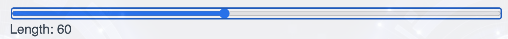
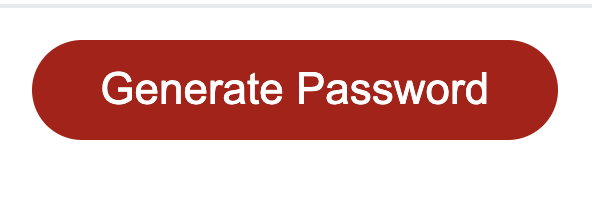
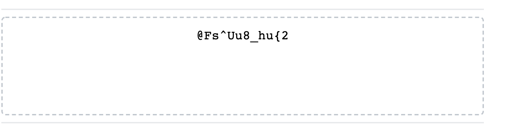
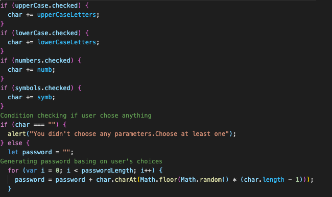
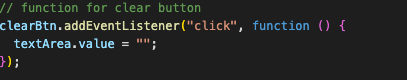
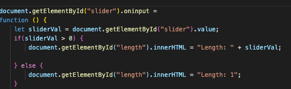

Password Generator project allows you create a random password with combination of characters that you can choose.

Link to deployed project  https://slugovoy.github.io/password-generator/

You need to make several decisions till you will get a random password

## 1. Choose password length with slider 

## 2. Choose options that you would like to have in your password

## 3. Push button "Generate"

## 4. You will get a random password as a result

## 5. If you want to delete generated password, press button "Clear"

Conditions that allow to check if user chose any options and loop for generating pawwsord.

Function that allows clear field with password

Function that allows track the value of slider and display it on a screen

   ## *Technologies, languages, frameworks been used:*

1. Javascript - used to dynamically change html and store user-input.
2. HTML - used to create elements on the DOM.
3. CSS - used for styling html elements on page.
4. Query - Used for event listeners of elements as well as to store and recall varibles in local storage to be displayed dynamically in HTML on the page.
5. Bootstrap - used for creating resposive structure and styling for this app.
6. Local storage - used to keep the variables and their values.

   ## *License*

The MIT License (MIT)

Copyright (c) 2020 Sergey Lugovoy

Permission is hereby granted, free of charge, to any person obtaining a copy of this software and associated documentation files (the "Software"), to deal in the Software without restriction, including without limitation the rights to use, copy, modify, merge, publish, distribute, sublicense, and/or sell copies of the Software, and to permit persons to whom the Software is furnished to do so, subject to the following conditions:

The above copyright notice and this permission notice shall be included in all copies or substantial portions of the Software.

THE SOFTWARE IS PROVIDED "AS IS", WITHOUT WARRANTY OF ANY KIND, EXPRESS OR IMPLIED, INCLUDING BUT NOT LIMITED TO THE WARRANTIES OF MERCHANTABILITY, FITNESS FOR A PARTICULAR PURPOSE AND NONINFRINGEMENT. IN NO EVENT SHALL THE AUTHORS OR COPYRIGHT HOLDERS BE LIABLE FOR ANY CLAIM, DAMAGES OR OTHER LIABILITY, WHETHER IN AN ACTION OF CONTRACT, TORT OR OTHERWISE, ARISING FROM, OUT OF OR IN CONNECTION WITH THE SOFTWARE OR THE USE OR OTHER DEALINGS IN THE SOFTWARE.

## *My contacts:*
1. Email serg.lugovoy.81@gmail.com
2. Phone - +1(954)303-3692

